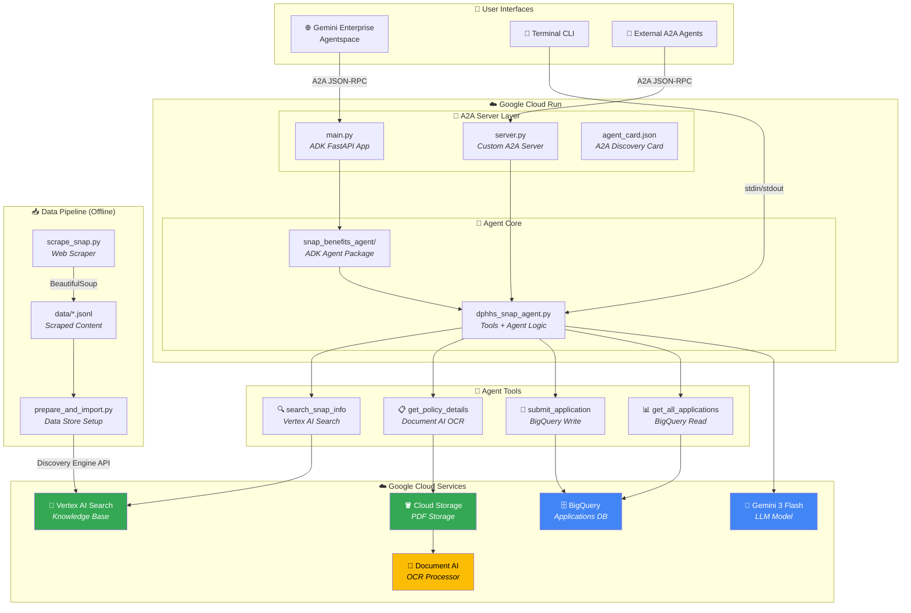
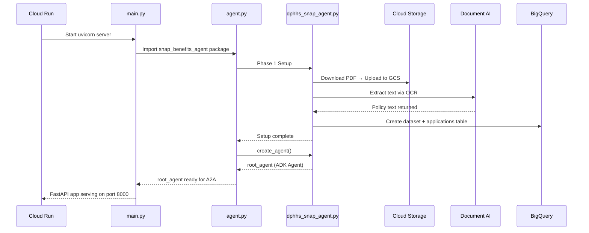

# AI Studio Prompt: Generate a Beautiful Single-Page Website

## Instructions for AI Studio

Create a stunning, modern, single-page website (one self-contained HTML file with inline CSS and JS) that showcases the **Montana SNAP Benefits Agent** — an AI-powered government services agent built on Google Cloud. The website should be presentation-quality, suitable for a technical demo to executives and engineers.

**Design Requirements:**
- Dark theme with a gradient hero section (deep navy `#0a192f` → teal `#1a365d`)
- Accent colors: Google Blue `#4285F4`, Google Green `#34A853`, teal `#00BCD4`, amber `#FFC107`
- Clean typography using Google Fonts (Inter for body, JetBrains Mono for code)
- Smooth scroll navigation with a sticky top nav bar
- Animated sections that fade in on scroll
- Mobile responsive
- Use Font Awesome or inline SVGs for icons
- Include a Mermaid.js architecture diagram (rendered via CDN)
- Glass-morphism cards for each component
- A timeline/flow visualization for the data pipeline

---

## Content for the Website

### Hero Section
**Title:** Montana SNAP Benefits Agent  
**Subtitle:** An AI-Powered Government Services Agent Built on Google Cloud  
**Tagline:** Helping Montana residents navigate SNAP benefits with conversational AI, powered by Gemini, Vertex AI Search, Document AI, and the Agent-to-Agent (A2A) protocol.  
**Tech badges:** Google ADK · Gemini 3 Flash · Vertex AI Search · Document AI · BigQuery · Cloud Run · A2A Protocol · FastAPI

---

### Section 1: Architecture Overview

Include a **Mermaid.js diagram** using this definition:



Also include a **simplified flow diagram** for the startup sequence:



---

### Section 2: File-by-File Breakdown

Present each file as a card with an icon, filename, role, and description. Group them into logical categories.

#### 🚀 Server & Deployment

| File | Role | Description |
|------|------|-------------|
| **main.py** (16 lines) | Production Entrypoint | Uses Google ADK's built-in `get_fast_api_app()` with `a2a=True` to auto-discover the agent package and serve it via the A2A protocol. The simplest possible entrypoint — just 5 lines of config. Deployed on Cloud Run. |
| **server.py** (381 lines) | Custom A2A Server | A full-featured alternative A2A server with custom JSON-RPC 2.0 handling. Implements `message/send`, `tasks/send`, and `tasks/get` methods. Features background Phase 1 setup (non-blocking), agent card discovery at `/.well-known/agent.json`, health check endpoint, multi-turn session management via task→session ID mapping, and A2A v0.2.1 task response building. |
| **agent_card.json** | A2A Discovery Card | Machine-readable agent manifest following the A2A protocol v0.3.0 spec. Declares the agent's 4 skills (snap-search, policy-lookup, submit-application, list-applications), supported I/O modes (text/plain), JSON-RPC transport, and production Cloud Run URL. Used by Gemini Enterprise/Agentspace for agent discovery. |
| **Dockerfile** | Container Definition | Python 3.11-slim based container. Installs `google-adk[a2a]`, `a2a-sdk`, and all Google Cloud client libraries. Copies the agent module, package, and entrypoint. Exposes port 8000 and runs uvicorn. |
| **startup.sh** | Startup Script | Shell script for Cloud Run startup orchestration. |
| **requirements.txt** | Dependencies | Lists all Python dependencies: google-adk, a2a-sdk, google-cloud-bigquery, google-cloud-storage, google-cloud-documentai, google-cloud-discoveryengine, requests, uvicorn, fastapi. |

#### 🧠 Agent Core

| File | Role | Description |
|------|------|-------------|
| **dphhs_snap_agent.py** (495 lines) | Core Agent Module | The heart of the system. Contains all infrastructure setup (Phase 1) and agent logic (Phases 2-3). **Phase 1:** Downloads SNAP Policy Manual PDF from `dphhs.mt.gov`, uploads to Cloud Storage, extracts text via Document AI OCR, and creates BigQuery dataset/table for applications. **Phase 2:** Defines 4 agent tools — `search_snap_info` (Vertex AI Search queries with snippets + AI summaries), `get_policy_details` (returns OCR-extracted policy text), `submit_application` (writes to BigQuery), `get_all_applications` (reads from BigQuery). **Phase 3:** Creates a Gemini 3 Flash-powered ADK Agent with a detailed system instruction for empathetic, accurate SNAP assistance. Also includes an interactive terminal loop for local testing. |
| **snap_benefits_agent/agent.py** (38 lines) | ADK Agent Package Entry | The bridge between ADK's auto-discovery and the core agent module. Runs Phase 1 infrastructure setup at import time, then exports `root_agent` which ADK's A2A server uses to handle requests. |
| **snap_benefits_agent/\_\_init\_\_.py** | Package Init | Re-exports the agent submodule (`from . import agent`) to make the package discoverable by ADK's `get_fast_api_app()`. |
| **snap_benefits_agent/agent.json** | Agent Manifest | A2A agent card bundled with the package. Declares skills, capabilities, and metadata for the ADK framework. |

#### 🔍 Data Pipeline

| File | Role | Description |
|------|------|-------------|
| **dphhs_snap_scrape/scrape_snap.py** (191 lines) | Web Scraper | Scrapes 5 SNAP-related pages from Montana's DPHHS website (`dphhs.mt.gov`) using `requests` + `BeautifulSoup`. Extracts clean text content by stripping nav/header/footer/scripts. Saves individual JSON files and a combined JSONL file for Vertex AI Search ingestion. Includes polite scraping with delays and custom User-Agent. Pages scraped: SNAP main, overpayment, policy manual index, TEFAP, and HCSD overview. |
| **dphhs_snap_scrape/prepare_and_import.py** (183 lines) | Vertex AI Search Setup | One-time setup script that creates a Vertex AI Search data store, imports scraped SNAP documents (from JSONL), and creates a search engine/app. Uses the Discovery Engine API to create documents with structured metadata and inline text content. Links the data store to an enterprise-tier search app with LLM add-on for AI-powered summaries. |
| **dphhs_snap_scrape/data/*.json** | Scraped Data | Individual JSON files for each scraped DPHHS page (snap_main, snap_overpayment, snap_manual_index, snap_tefap, snap_hcsd_overview). Each contains structured metadata (title, URL, source, category, timestamp) and extracted text content. |
| **dphhs_snap_scrape/data/all_snap_documents.jsonl** | Combined Dataset | All scraped documents in JSONL format (one JSON object per line) — the input format for Vertex AI Search document import. |
| **dphhs_snap_scrape/data/text_for_import/*.txt** | Plain Text Exports | Clean text versions of scraped content, including the SNAP policy income standards table. Used as reference and for alternative import methods. |

#### 🧪 Testing & Documentation

| File | Role | Description |
|------|------|-------------|
| **test_vertex_search.py** | Search Testing | Test script to verify Vertex AI Search is working correctly — sends test queries and validates results from the SNAP knowledge base. |
| **reimport_vertex_search.py** | Data Re-import | Utility to re-import documents into Vertex AI Search data store if data needs refreshing. |
| **GEMINI_ENTERPRISE_A2A_SETUP.md** | Setup Guide | Step-by-step documentation for connecting the agent to Gemini Enterprise Agentspace via the A2A protocol. Covers Cloud Run deployment, agent card configuration, and Agentspace registration. |
| **snap_policy_extracted.txt** | Extracted Policy Text | The SNAP Policy Manual text extracted by Document AI OCR — contains the Table of Standards with gross/net monthly income limits and Thrifty Food Plan benefit amounts by household size. |
| **snap_standards.pdf** | Source PDF | The original SNAP Policy Manual PDF downloaded from DPHHS (Table of Standards SNAP001). |

---

### Section 3: The 4 Agent Skills (Tools)

Present these as large interactive-looking cards with icons:

#### 🔍 SNAP Benefits Search (`search_snap_info`)
- **Powered by:** Vertex AI Search (Enterprise tier with LLM add-on)
- **What it does:** Queries the SNAP knowledge base built from scraped DPHHS website content. Returns AI-generated summaries with citations, snippets, and extractive answers.
- **Example queries:** "Am I eligible for SNAP benefits?", "How do I apply for SNAP in Montana?", "Can I use my EBT card at farmers markets?"
- **Data source:** 5 scraped DPHHS web pages + SNAP policy documents

#### 📋 Policy Details Lookup (`get_policy_details`)
- **Powered by:** Document AI OCR + Cloud Storage
- **What it does:** Returns the full SNAP Policy Manual text extracted from the official PDF using Document AI OCR. Contains exact income thresholds (GMI/NMI) and Thrifty Food Plan benefit amounts by household size.
- **Example queries:** "What are the income limits for a family of 4?", "How much SNAP benefit would I get?"
- **Data source:** SNAP001.pdf from dphhs.mt.gov (Table of Standards)

#### 📝 Submit Application (`submit_application`)
- **Powered by:** BigQuery
- **What it does:** Submits a new SNAP benefits application by writing applicant details to a BigQuery table. Captures applicant name, household size, monthly income, county, and optional phone number. Returns a unique application ID and confirmation.
- **Schema fields:** application_id, applicant_name, household_size, monthly_income, county, contact_phone, status, created_at

#### 📊 List Applications (`get_all_applications`)
- **Powered by:** BigQuery
- **What it does:** Retrieves all submitted SNAP benefit applications from BigQuery, ordered by creation date (newest first). Returns complete application details including status.

---

### Section 4: Technology Stack

Present as a grid of logos/badges:

| Layer | Technology | Purpose |
|-------|-----------|---------|
| **LLM** | Gemini 3 Flash Preview | Conversational AI reasoning and response generation |
| **Agent Framework** | Google Agent Development Kit (ADK) | Agent orchestration, tool calling, session management |
| **Protocol** | A2A (Agent-to-Agent) v0.3.0 | Interoperability standard for agent communication |
| **Search** | Vertex AI Search (Enterprise) | RAG-based knowledge retrieval with AI summaries |
| **OCR** | Document AI | PDF text extraction from government policy documents |
| **Database** | BigQuery | Application data storage and querying |
| **Storage** | Cloud Storage | PDF document storage |
| **Compute** | Cloud Run | Serverless container hosting |
| **Web Framework** | FastAPI + Uvicorn | ASGI web server with async support |
| **Scraping** | BeautifulSoup + Requests | Web content extraction from DPHHS website |
| **Container** | Docker (Python 3.11-slim) | Reproducible deployment packaging |
| **Transport** | JSON-RPC 2.0 | A2A protocol communication format |

---

### Section 5: Data Flow Pipeline

Show this as a horizontal timeline/pipeline visualization:

```
1. SCRAPE                2. PROCESS              3. INDEX                4. SERVE
┌─────────────┐     ┌─────────────┐      ┌─────────────┐      ┌─────────────┐
│ scrape_snap  │────▶│  JSON/JSONL  │─────▶│ Vertex AI   │─────▶│ Agent uses  │
│    .py       │     │   Files      │      │ Search      │      │ search_snap │
│              │     │              │      │ Data Store  │      │ _info tool  │
│ 5 DPHHS pages│     │ Structured   │      │             │      │             │
│ scraped via  │     │ metadata +   │      │ Enterprise  │      │ Returns AI  │
│ BeautifulSoup│     │ clean text   │      │ tier + LLM  │      │ summaries   │
└─────────────┘     └─────────────┘      └─────────────┘      └─────────────┘

5. PDF PIPELINE
┌─────────────┐     ┌─────────────┐      ┌─────────────┐      ┌─────────────┐
│ DPHHS.mt.gov│────▶│ Cloud       │─────▶│ Document AI │─────▶│ Agent uses  │
│ SNAP001.pdf  │     │ Storage     │      │ OCR         │      │ get_policy  │
│ downloaded   │     │ Bucket      │      │ Processor   │      │ _details    │
└─────────────┘     └─────────────┘      └─────────────┘      └─────────────┘
```

---

### Section 6: How It Works (User Journey)

Show as a numbered step flow:

1. **User asks a question** → "Am I eligible for SNAP?" via Gemini Agentspace or terminal
2. **A2A Protocol routes request** → JSON-RPC 2.0 message arrives at Cloud Run endpoint
3. **ADK Agent processes** → Gemini 3 Flash analyzes intent, selects appropriate tool
4. **Tool executes** → Vertex AI Search queries knowledge base OR Document AI returns policy text OR BigQuery handles applications
5. **Agent responds** → Empathetic, accurate answer with citations and official resources
6. **Multi-turn context** → Session maintained for follow-up questions

---

### Section 7: Key Stats

Display as large animated counters:

- **495** lines of core agent code
- **4** specialized AI tools
- **7** Google Cloud services integrated
- **5** DPHHS web pages indexed
- **~1,200** lines total codebase
- **1** Gemini model powering it all

---

### Footer

**Montana SNAP Benefits Agent** — Built with ❤️ using Google Cloud AI  
A2A Protocol v0.3.0 · Google ADK · Gemini 3 Flash Preview  
Helping Montana residents access the benefits they need.

---

## Technical Notes for AI Studio

1. Use Mermaid.js CDN (`https://cdn.jsdelivr.net/npm/mermaid/dist/mermaid.min.js`) for the architecture diagrams
2. Make the Mermaid diagrams render in a dark-themed container with proper sizing
3. Use CSS Grid for the file cards and tech stack sections
4. Add subtle CSS animations: fade-in on scroll (Intersection Observer), hover effects on cards, pulsing accent borders
5. The page should look like a premium product documentation / landing page
6. Include a table of contents in the sticky nav: Architecture | Files | Skills | Tech Stack | Data Flow | How It Works
7. Make it print-friendly as well (media query for print)
8. Total file should be under 500KB — keep it self-contained
9. Use emoji as icons where appropriate to keep it lightweight
